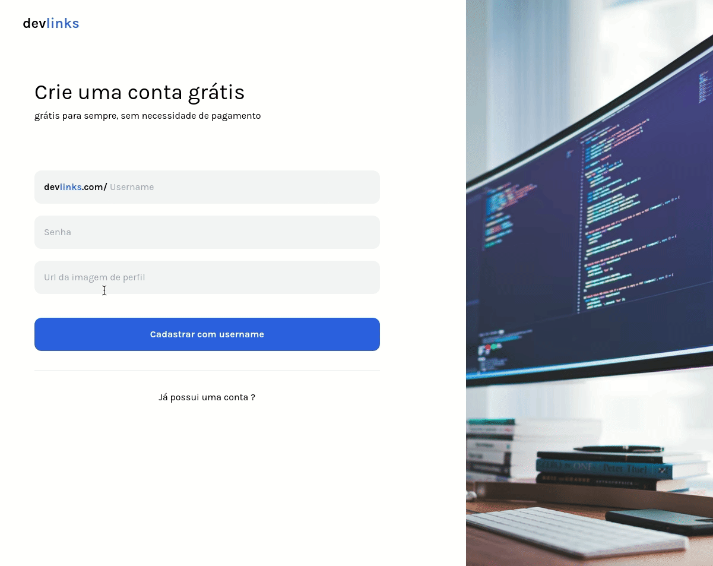

# devlinks 🔗

projeto de links baseado no linktree, onde terá um dashboard para o criador da página adiconar novos links estando autenticado e sem autenticação onde os usuários podem acessar as páginas e seus links

- Imagens das telas individualmente na pasta github

## tecnologias 📌

### api

- prisma
- node
- typescript
- json web token
- arquitetura e padrões de projetos

### front-end

- next.js
- yup
- formik
- tailwind
- react-hot-toast
- react-loading

---

Feito por Marcos Henrique ⚡